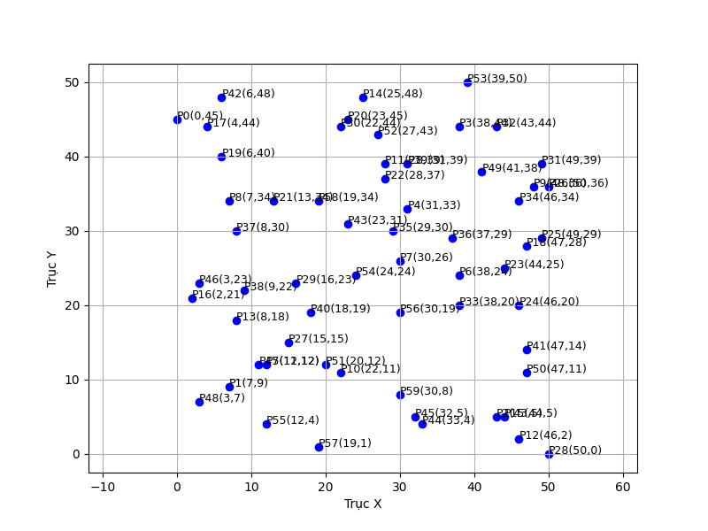
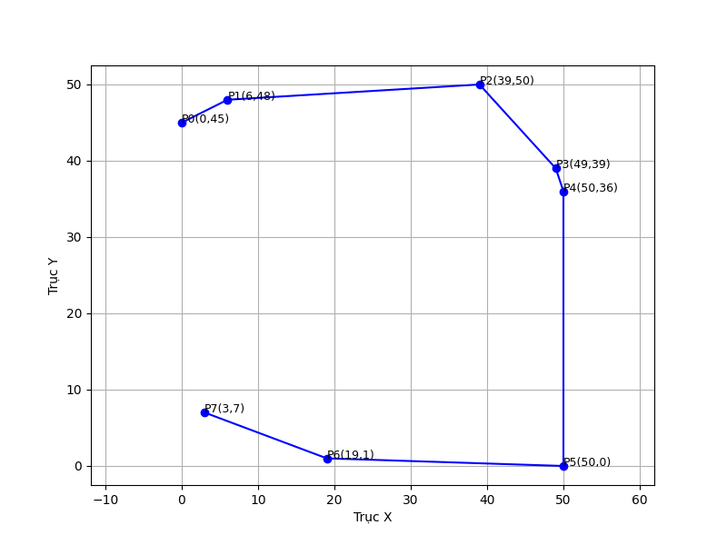
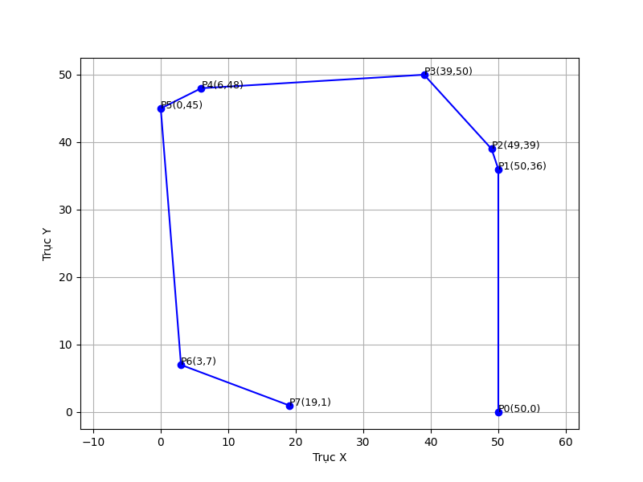
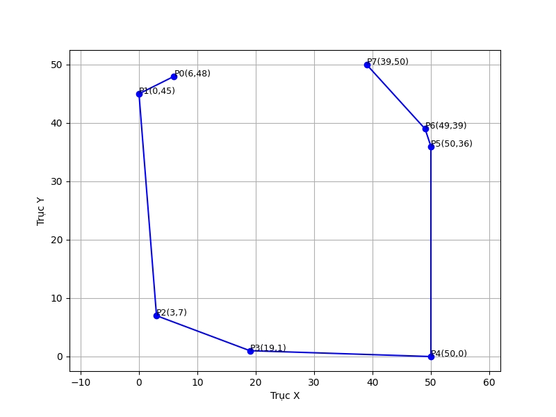
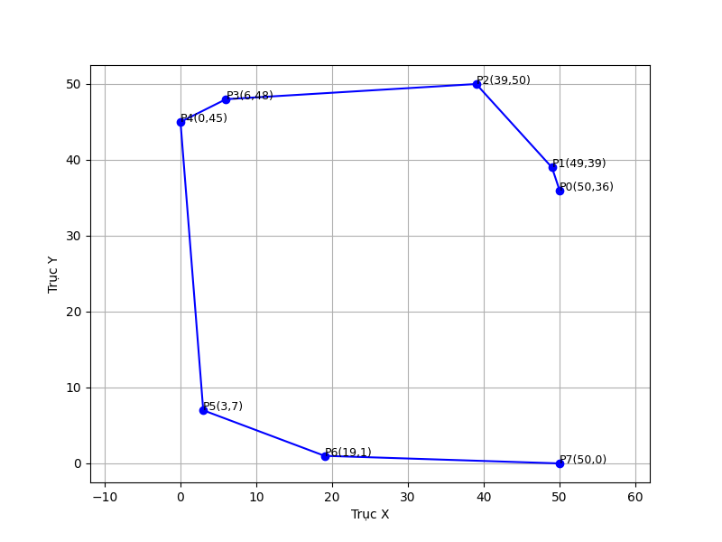

# Convex-Hull-Algorithms
## Overview
This project provides **C++ implementations** of several convex hull algorithms, including:

- Monotone Chain  
- Graham Scan  
- Jarvis March  
- Divide and Conquer  
- Chan's Algorithm  

The goal is to compare different approaches to solving the convex hull problem, analyze their outputs, and visualize the results.  

---
# Experiments
## Input

```
0,45,7,9,43,5,38,44,31,33,12,12,38,24,30,26,7,34,48,36,22,11,28,39,46,2,8,18,25,48,44,5,2,21,4,44,47,28,6,40,23,45,13,34,28,37,44,25,46,20,49,29,50,36,15,15,50,0,16,23,22,44,49,39,43,44,38,20,46,34,29,30,37,29,8,30,9,22,31,39,18,19,47,14,6,48,23,31,33,4,32,5,3,23,11,12,3,7,41,38,47,11,20,12,27,43,39,50,24,24,12,4,30,19,19,1,19,34,30,8
```
## Output
## Monotone Chain

```
0, 45, 6, 48, 39, 50, 49, 39, 50, 36, 50, 0, 19, 1, 3, 7
```
## Graham Scan

```
50, 0, 50, 36, 49, 39, 39, 50, 6, 48, 0, 45, 3, 7, 19, 1
```
## Jarvis March

```
0, 45, 6, 48, 39, 50, 49, 39, 50, 36, 50, 0, 19, 1, 3, 7
```
## Divide And Conquer

```
6, 48, 0, 45, 3, 7, 19, 1, 50, 0, 50, 36, 49, 39, 39, 50
```
## Chan's Algorithm

```
50, 36, 49, 39, 39, 50, 6, 48, 0, 45, 3, 7, 19, 1, 50, 0
```
---

## Notes
- This project focuses on the **C++ implementation** and comparison of convex hull algorithms.  
- The convex hull outputs are **visualized using Python’s Matplotlib** library for better illustration.  
